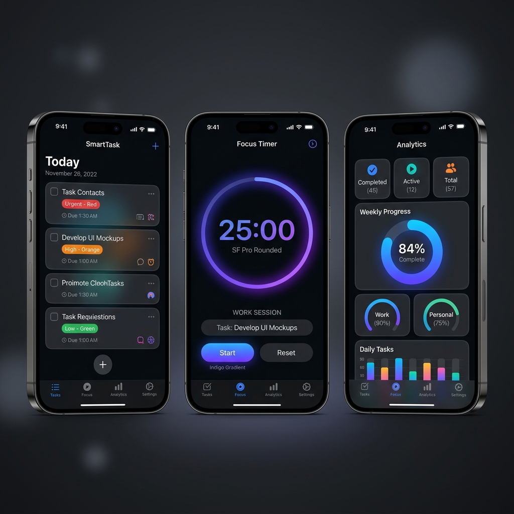

# SmartTask - Premium iOS Task & Time Management App

SmartTask is a beautifully crafted, premium native iOS Task Management and Time-Tracking application built from the ground up using **SwiftUI**. It acts as your personal productivity playground, combining intuitive task organization (CRUD) with professional timer mechanisms and dynamic analytics.

---

## 📱 Visual Preview

Below is a preview of the SmartTask iOS application screens running in **iOS Dark Mode**:

---

## ✨ Key Features

1. **Complete Task CRUD**:
   * **Create**: Quickly add tasks with rich descriptions, priorities (High, Medium, Low), and custom due dates.
   * **Read**: Seamlessly navigate through tasks using clean segmented tab filters (All, Active, Completed).
   * **Update**: Check tasks to mark them complete with sleek animations, or edit title and details inline.
   * **Delete**: Perform swift swipe-to-delete gestures to clean up your dashboard.
2. **Integrated Focus Timer**:
   * Standard stopwatch to record exact working sessions.
   * Interactive circular progress rings tracking elapsed time.
   * Direct time logging linking back to your specific active tasks.
3. **Productivity Analytics**:
   * Quick summary cards showing completion ratios and overall tracked hours.
   * Visual progress gauges showing completion rates.
   * Breakdown details of tasks sorted by total hours logged.
4. **Data Persistence**:
   * Built-in local persistence leveraging standard iOS protocols to keep your tasks and time tracking data persistent across app sessions.

---

## 🚀 How to Run the App on your iPhone

To run this application on your own personal device, follow these steps:

1. **Prerequisites**:
   * A Mac running macOS with **Xcode** (13.0+) installed.
   * A physical iPhone (iOS 15.0+) and a USB connecting cable.
2. **Open the Project**:
   * Open Xcode, select **File > Open**, and select `SmartTask/SmartTask.xcodeproj`.
3. **Configure Signing**:
   * Click on the **SmartTask** project root in the left navigator.
   * Navigate to the **Signing & Capabilities** tab.
   * Check **"Automatically manage signing"**.
   * Under the **Team** dropdown, select your personal Apple ID/Developer account (free tier is fully compatible!).
4. **Build and Run**:
   * Connect your physical iPhone to your Mac via USB.
   * Change the active build destination at the top of Xcode to your connected **iPhone**.
   * Hit the **Run** button `(Cmd + R)` or tap the Play icon.
5. **Trust the Certificate (First time only)**:
   * Once installed, if the app fails to open on your device, open your iPhone's **Settings > General > VPN & Device Management**.
   * Select your developer certificate under Developer App and tap **"Trust"**.
   * Launch **SmartTask** and start mastering your productivity!

---

## 🛠️ Tech Stack & Architecture

* **Framework**: Native SwiftUI (iOS 15.0+)
* **Architecture**: MVVM-based design pattern.
* **Storage**: Local persistence utilizing JSON Codable and iOS `UserDefaults`.
* **Automation**: Custom ruby configuration scripts to build project manifests cleanly without standard `.pbxproj` Git conflicts.
